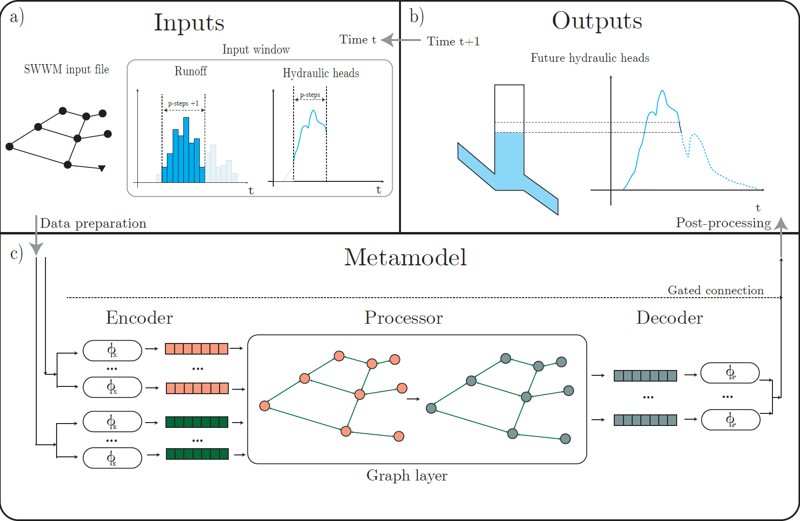

# SWMM GNN - Machine Learning Metamodels for Urban Drainage Systems with SWMM

### Paper repository for "Transferable and Data Efficient Metamodeling of Storm Water System Nodal Depths Using Auto-Regressive Graph Neural Networks"

[](https://opensource.org/licenses/MIT)

<!-- Use scikit-learn README as guideline -->
(Version 1.2.0 - Sept. 11th, 2024)

This repository contains the code for developing machine learning metamodels of SWMM.

In brief, this code allows to create a dataset from SWMM simulations, train a machine learning model, and evaluate the model. The code is designed to work with SWMM simulations of storm water systems. The code is based on PyTorch and PyTorch Geometric.



<details>
**Figure 1:** Summary of the process to generate a prediction for one future time step of hydraulic heads using the GNN metamodel. Subsequent predictions are obtained by iteratively repeating this process. The inputs are partial timeseries of runoff and hydraulic heads, and system information (topology, node elevation, pipe diameters, and lengths) in the SWMM input file.
The data is organized in windows and normalized before entering the artificial neural network. Using multi-layer perceptrons, 𝜙, the metamodel separately computes the embedding of nodes and pipes which are fed to the graph layer that acts as processor. The output of this phase is then decoded by the processor, which returns the processed embedding into physical values. These values are finally post-processed to obtain a new prediction of hydraulic heads. Having these values, the process repeats to determine the entire time series.

</details>

This code is linked to the paper ["Transferable and Data Efficient Metamodeling of Storm Water System Nodal Depths Using Auto-Regressive Graph Neural Networks"](https://doi.org/10.1016/j.watres.2024.122396) by Alexander Garzón, Zoran Kapelan, Jeroen Langeveld, and Riccardo Taormina.

## Table of Contents

- [Functionality](#functionality)
- [Installation](#installation)
- [Usage](#usage)
- [ML Experiment](#ml-experiment)
- [Testing](#testing)
- [Current limitations](#current-limitations)
- [Citation](#citation)
- [Acknowledgements](#acknowledgements)
- [Licensing and waiver](#licensing-and-waiver)


## Functionality

The functionality of the code in this repository includes:

- **Data preparation:** Creation of the dataset for training, validating, and testing the models. The dataset is created by running SWMM simulations with different rainfall events. The results of the simulations are stored in CSV files. (See [Database creation notebook](notebooks/Database_creation.ipynb)). This functionality includes:

  - **SWMM dataset generation:** Creation and reading of rainfall events that are used as inputs for the SWMM model.
  - **Extraction of SWMM Simulation results:** Conversion from SWMM output file to NetworkX object and to PyTorch Geometric objects which are used for training, validating, and testing.

- **Model development:** Set up and training of the models. The models are trained using the dataset created in the previous step. The code uses the class MLExperiment as a wrapper where multiple steps are concatenated. This class gathers all the necessary elements to train a Machine Learning model. Based on the configuration file (e.g., [Tuindorp development GNN.yaml](<configs/Tuindorp development GNN.yaml>)), it creates (or loads) the windows, initializes the model, defines the trainer, trains the model, and displays the results. (See [Model development notebook](notebooks/Model_development.ipynb)). This functionality includes:
  - **Loading:** Load the information from the SWMM simulations.
  - **Windowing:** Dividing the time series into windows. Each window is a graph with nodes representing the hydraulic head levels at given time steps. The edges represent the pipes between the nodes.
  - **Normalization:** Each window is normalized based on the characteristics of the windows in the training dataset. 
  - **Set up the model:** The code contains two main PyTorch models
    - [GNN based metamodel](libraries/models/GNN_model.py)
    - [MLP based metamodel](libraries/models/MLP_model.py)  
  - **Training:** It follows the traditional PyTorch implementation of a training loop. It considers early stopping and best model selection (based on validation loss.)
  - **Visualization:** Visualization of results in an interactive graph which displays the time series of any given node. It allows the visualization of Coefficient of Determination (COD) (for dry and wet weather) and hydraulic head levels.

- **Testing:** Evaluation of the models. The models are evaluated using the test dataset. The evaluation includes the calculation of the Coefficient of Determination (COD) for dry and wet weather. (See [Model testing notebook](notebooks/Model_testing.ipynb)).

## Installation

There are two ways of installing the required libraries. 

### Using Poetry (recommended)

1. Make sure you have Poetry installed. If not, follow the instructions on the [Poetry documentation](<https://python-poetry.org/docs/#installation>).
2. Execute the following command in the root directory of the repository:

```bash
poetry install
```

The pyproject.toml file contains all the required libraries.

### Using pip

The required libraries are also in the file requirements.txt. 

1. Execute the following command in the root directory of the repository:

```bash
pip install -r requirements.txt
```
<!-- The data for the case study is too heavy for this repository. A copy of the required files is stored at: <https://surfdrive.surf.nl/files/index.php/s/ZShcKx21MDfZCfH>. -->

## Environment variables set up

For the code to work properly, it is necessary to set up the environment variables. The environment variables are stored in a .env file in the root directory of the project. The .env file should follow the following structure, for example:

```lang-txt
# General Configuration
PROJECT_NAME=Simulations
JOB_TYPE=Training
TAGS=GNN
NOTES=These are notes

# Directory for wandb logging
WANDB_DIR=C:\Users\<User>\<Folder>\wandb

# Database and Model Paths
DATA_FOLDER=C:\Users\<User>\<Folder>\SWMM data\
SAVED_OBJECTS_FOLDER=C:\Users\<User>\<Folder>\saved_objects\
YAML_FOLDER=C:\Users\<User>\<Folder>\configs

# SWMM Configuration
SWMM_EXECUTABLE_PATH=C:\Program Files (x86)\EPA SWMM 5.1.015\swmm5.exe 

```

You must set up the paths according to your system.

## Usage

### Dataset generation

#### Reproducing the case study 
In case you want to reproduce the models for the case study, you can find all the data used in the study in this [link](<https://doi.org/10.4121/fec1e3de-9586-4a61- 649b3a1-02382592e52c>). Otherwise, you can generate the data by following the instructions below.

#### Required data

Create a folder structure as follows:

```lang-txt
saved_objects
|__real_rainfalls
|__[Case study name]
  |__networks
    |__[SWMM input file].inp
  |__rainfall_dats
    |__training
    |__validation
    |__testing}
```

For the generation of the dataset, it is necessary to count with the information of the real rainfalls in the folder "saved_objects\real_rainfalls". For the case study, the file contains rainfall events of 5 minutes resolution extracted from the files from KNMI - The Netherlands over the case study in the year 2014.

- In the folder "saved_objects", add your SWMM input file (.inp) in the folder [case study name]/networks
  - Optional: In case you have rainfall files (.dat), add them in the folders saved_objects/[case study name]/rainfall_dats/[training, validation, testing].
- The code for generating the rainfall files (.dat) and the SWMM simulations is in the notebook [Database_creation](notebooks/Database_creation.ipynb).
- Inside the folder networks, there should be the SWMM input file (.inp) of the drainage network. This drainage network should have a rain gage with the name R1, and its data series should be called "PLACEHOLDER1". For example,

```lang-txt
[RAINGAGES]
;;Name           Format    Interval SCF      Source
;;-------------- --------- ------ ------ ----------
; Name Format Interval SCF Source
R_1              INTENSITY 0:05     1.0      FILE       "PLACEHOLDER1" R1         MM
```

- Adjust the time steps for the routing, the runoff and the reporting. For example, 1 minute for the Wet Weather runoff, 1 minute for the Dry Weather runoff, and 1 second for the routing.

## ML Experiment

The main notebook for exploring how to run an experiment is **[Model development](notebooks/Model_development.ipynb)**. This notebook runs an experiment based on the settings especified in the yaml file (e.g., [Tuindorp development GNN.yaml](<configs/Tuindorp development GNN.yaml>)).

The yaml file contains the configuration for the experiment. The yaml file is divided into two parts. The first part is dedicated to specify the network and the hot start options. This is, if there are windows saved from previous runs, the code can use them. Also, if there are pre-trained models, the code can use those weights. The second part is dedicated to the training settings and the hyperparameters.

> ⚠ Notice that not all the hyperparameters are used for all the models. E.g., the MLP model does not use the hyperparameters `k_hops` or `eps_gnn`, which are related to the GNN model.

An example of a yaml file is:

<details>

```lang-yaml
# Data settings
network: 'Tuindorp development - 1 min resolution'

# Hot start options
use_saved_training_windows  : True
use_saved_validation_windows: True
## Names of saved windows in saved objects/saved windows/{network}/ in pickle format.
training_windows_names:
  - 'tra_windows_9be_2ah_40_events.pk'
  - 'tra_windows_9be_10ah_40_events.pk'
validation_windows_name : 'val_windows_9be_50ah_29_events.pk'

## Use of Transfer Learning
use_pre_trained_weights: True
requires_freezing: False
pre_trained_weights: 'Best_model_NN_GINEConv_NN.pt' #If use_pre_trained_weights is false, this line is ignored

use_saved_normalizer: True
normalizer_name: "normalizer_development_tuindorp.pk"

# Training settings
trainer_name: 'Trainer_Heads'
node_loss_weight: 1
edge_loss_weight: 1

abs_flows: False

#Hyperparameters
epochs                 : 100
switch_epoch           : 50       # After this epoch, the length of the training window increases. This is for curriculum learning.

min_expected_loss      : 100      # Expected minimum validation loss. It prevents continue training models that diverged.

balance_ratio          : 4
batch_size             : 32
edge_input_list        : 'length, geom_1'
gamma_loss             : 1.00
gamma_scheduler        : 1.00
hidden_dim             : 32
learning_rate          : 0.00194
model_name             : "NN_GINEConv_NN"
n_hidden_layers        : 0
non_linearity          : "PReLU"
num_events_training    : 100
num_events_validation  : 30
prediction_steps       : 1
seed                   : 5
skip_alpha             : 0.8
steps_behind           : 9
steps_ahead            : 
  - 2
  - 10
steps_ahead_validation : 50
weight_decay           : 0.01
variance_threshold     : 0.005

# GNN specific hyperparameters
k_hops                 : 1
eps_gnn                : 0.5

# Results
nodes_to_plot:
  - "j_90679"
  - "j_90575"
  - "j_90550"
```

</details>

One of the most important parameters is the model name. This determines which model will be used. The model name is compared against the dictionary stored in "libraries\models\Model_main.py". When creating a new model, add the name to this dictionary so that it can be read from the yaml file.

Once you have the yaml file, there are two ways of executing the experiments.

### Using the notebook (recommended)

Run the notebook [Model development](notebooks/Model_development.ipynb). It has all the steps to run an experiment. In addition, you can visualize the results of the experiment with an interactive plot.

### Using the command line

Run the following command in the root directory of the repository:

```bash
python main.py --config <name of the yaml file inside of configs>
```

For example, to run the experiment with the Tuindorp development GNN.yaml file, run:

```bash
python main.py --config "Tuindorp development GNN.yaml"
```

## Testing

The main notebook for testing the models is **[Model testing](notebooks/Model_testing.ipynb)**. This notebook loads an experiment based on the settings especified in the yaml file (e.g., [Tuindorp development GNN.yaml](<configs/Tuindorp development GNN.yaml>)), extracts the test simulations, and evaluates the model based on the specified metrics. In addition, it estimates the execution time of the model per simulation.

## Current limitations

- The type of drainage systems that the code can handle is limited to the ones that can be represented in SWMM.
- The code can only handle systems with junctions, outfalls and pipes. It cannot handle systems with pumps, weirs, orifices, storage units or other types of special components.
- The code can only handle systems with one rain gage.
- The code does not handle offsets of the pipes in the network, it assumes that all the pipes are connected to invert of the nodes.
- The model does not support more parallel edges (e.g., two pipes connecting the same nodes).

## Citation

Please cite our paper as:

```lang-txt
@article{,
   author = {Alexander Garzón and Zoran Kapelan and Jeroen Langeveld and Riccardo Taormina},
   doi = {https://doi.org/10.1016/j.watres.2024.122396},
   issn = {0043-1354},
   journal = {Water Research},
   keywords = {Deep learning,Machine learning,SWMM,Surrogate modelling,Transfer learning,Urban drainage},
   pages = {122396},
   title = {Transferable and data efficient metamodeling of storm water system nodal depths using auto-regressive graph neural networks},
   url = {https://www.sciencedirect.com/science/article/pii/S0043135424012958},
   year = {2024},
}

```

## Acknowledgements

This work is supported by the TU Delft AI Labs programme.

This repository was supported by the Digital Competence Centre, Delft University of Technology.

## Licensing and waiver

Licensed under MIT, subject to waiver:

Technische Universiteit Delft hereby disclaims all copyright interest in the program “SWMM_GNN_Metamodel” (Transferable and Data Efficient Metamodeling of Storm Water System Nodal Depths Using Auto-Regressive Graph Neural Networks) written by the Author(s).

Prof.dr.ir. Stefan Aarninkhof, Dean of Civil Engineering and Geosciences

Copyright (c) 2024 Jorge Alexander Garzón Díaz.
